# Chest

### A modern self-hosted control panel for Minecraft servers.

[](https://www.gnu.org/licenses/agpl-3.0)
[](#testing)
[](#quick-start)
[](https://kit.svelte.dev)
[](https://bun.sh)

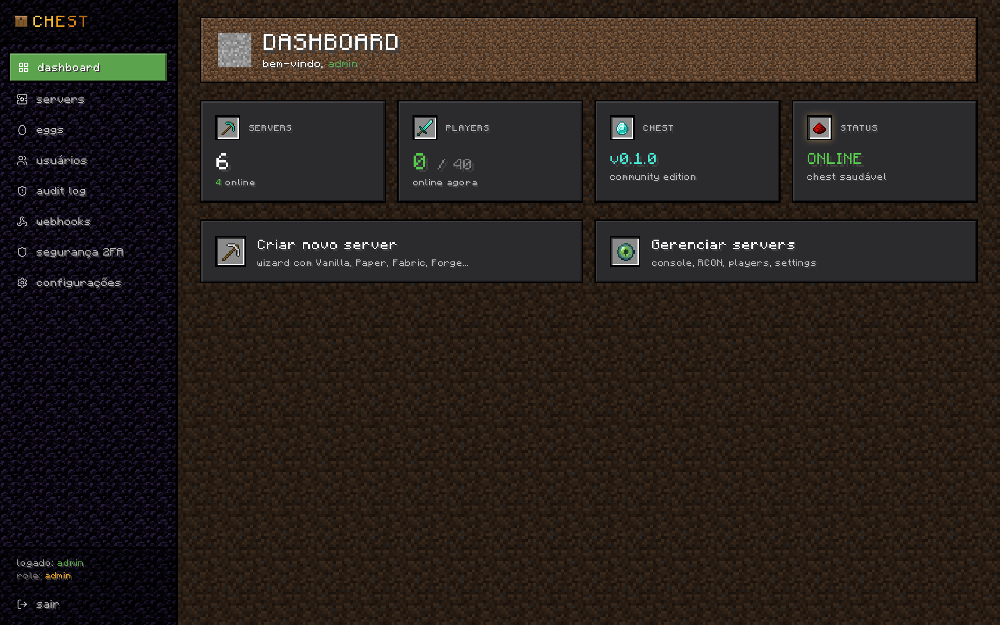

---

## Why Chest

Running a Minecraft server should not require gluing together a dozen tools, scripting your own backups, or accepting a panel that feels like enterprise hosting from 2014. The two dominant options today both make compromises that get in the way.

**Crafty Controller** is written in Python and shows it. The UI is dated, the runtime is heavy for what it does, and the architecture predates the container-first world most operators actually live in. It works, but it does not feel like software built for the current generation of Minecraft hosting.

**Pterodactyl** is powerful but generic. It manages any game, which means it manages none of them deeply. There is no first-class understanding of mods, modpacks, world resets, BlueMap, RCON nuance, or the specific operational shape of a Minecraft community. Every Minecraft feature is something you bolt on yourself.

Chest is the alternative. A modern SvelteKit and Bun stack for speed and small bundles. A Minecraft-first feature set: Modrinth mod search, modpack install, BlueMap embedded, RCON pooling, scheduled backups, world reset that preserves config. And a panel that looks intentional, not generated, because operators spend hours a day in it and the surface matters.

---

## Features

| Feature                          | Description                                                                                                              |
| -------------------------------- | ------------------------------------------------------------------------------------------------------------------------ |
| Container-first deploy           | Single `docker compose up -d`. Zero host dependencies, no scripts to install.                                            |
| Server templates (eggs)          | JSON-defined server presets for Vanilla, Paper, Fabric, Forge, NeoForge, Purpur, Spigot, Quilt, modpacks, and Cobblemon. |
| 5-step new-server wizard         | Pick template, name, port range, memory, public exposure mode. Server is running in under a minute.                      |
| Live console with RCON           | Server-Sent Events stream of container stdout plus a command box backed by a pooled RCON client.                         |
| Real-time and historical metrics | CPU, RAM, and player count graphs with 1h / 6h / 24h / 7d windows.                                                       |
| Modrinth integration             | Search mods live, filtered automatically by MC version and loader. One-click install, toggle, delete.                    |
| Modpack install                  | Full Modrinth `.mrpack` support, including overrides and dependency index.                                               |
| Embedded BlueMap                 | Sidecar BlueMap container per world, surfaced through an iframe directly in the panel.                                   |
| File manager                     | Browse, edit, upload, download, and delete files in the server volume with a safe path resolver.                         |
| `server.properties` editor       | Typed form for every vanilla property, with validation and inline help.                                                  |
| World tools                      | Reset world (preserves mods, config, whitelist, ops), change seed, regenerate map.                                       |
| Backups                          | Tarball backups with scope `world` or `full`, save-flush before snapshot, download / restore / delete.                   |
| Storage drivers                  | Local volume by default. Optional S3 or Cloudflare R2 driver for offsite backup retention.                               |
| Scheduler                        | Built-in cron parser, seven presets plus custom expressions. Tasks: backup, restart, RCON command.                       |
| Granular RBAC                    | Per-server roles and permissions, plus a subusers panel to delegate access without sharing admin.                        |
| TOTP 2FA                         | Per-user TOTP enrolment with QR code, recovery codes, and an audited disable flow.                                       |
| Audit log                        | Append-only log of every privileged action, with actor, target, IP, and diff.                                            |
| Webhooks                         | Outbound HMAC-signed webhooks on server lifecycle, backup, and security events.                                          |
| Drasl auth integration           | Toggle `authlib-injector` per server and point it at a self-hosted Drasl instance for offline-friendly auth.             |
| Discord bot bridge               | Bidirectional bridge: chat to and from a Discord channel, plus server status embeds.                                     |
| Hardened Docker access           | Talks to Docker through `docker-socket-proxy` with the minimum endpoint set. No bind-mounted socket.                     |
| Argon2id sessions                | Argon2id password hashing, hashed session tokens, httpOnly + secure cookies.                                             |

---

## Capturas de tela

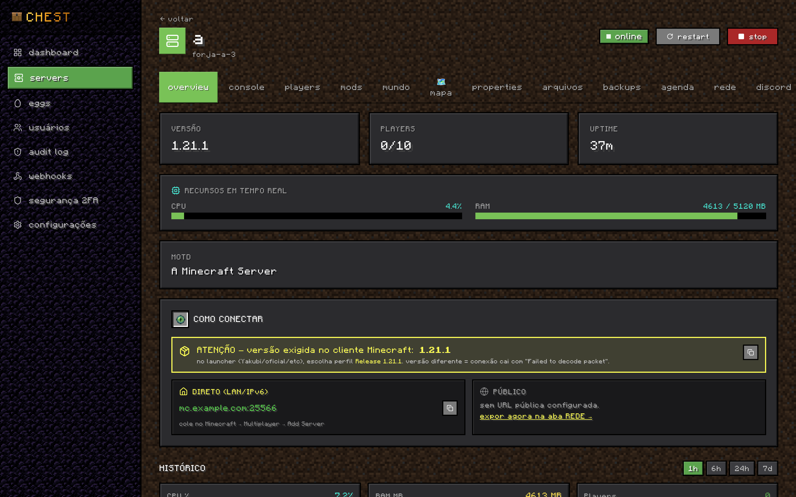

### Destaques

<table>
  <tr>
    <td width="50%"></td>
    <td width="50%">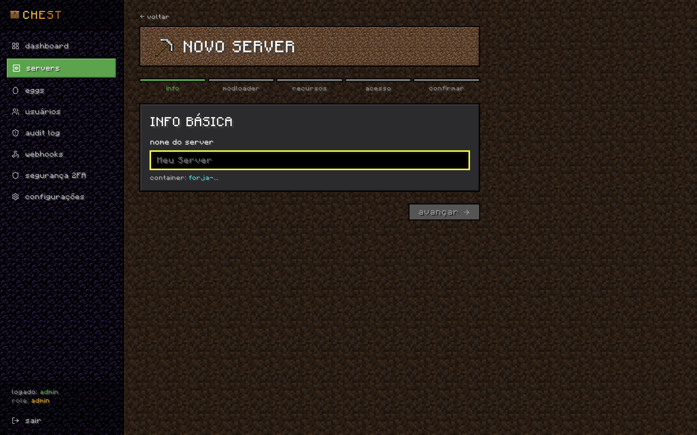</td>
  </tr>
  <tr>
    <td width="50%">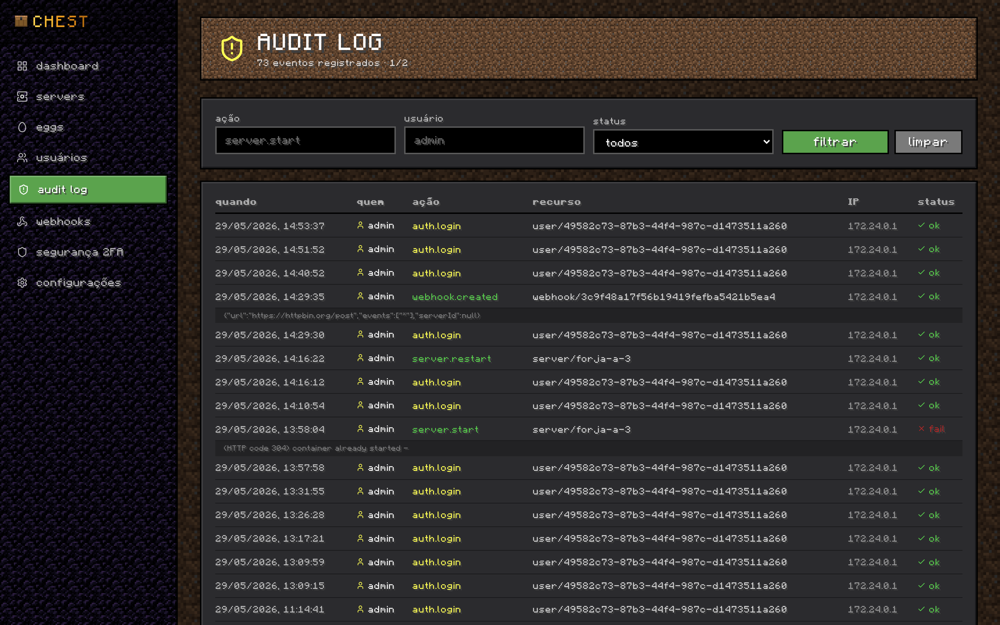</td>
    <td width="50%">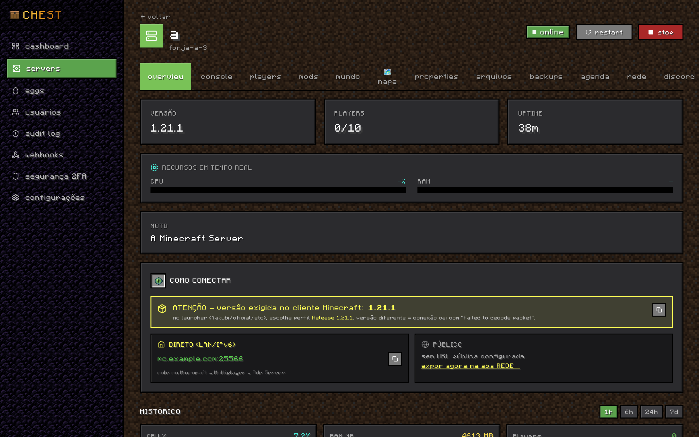</td>
  </tr>
</table>

<details>
<summary>Ver todas as capturas (17 telas)</summary>

#### Visao geral

<table>
  <tr>
    <td width="33%"></td>
    <td width="33%">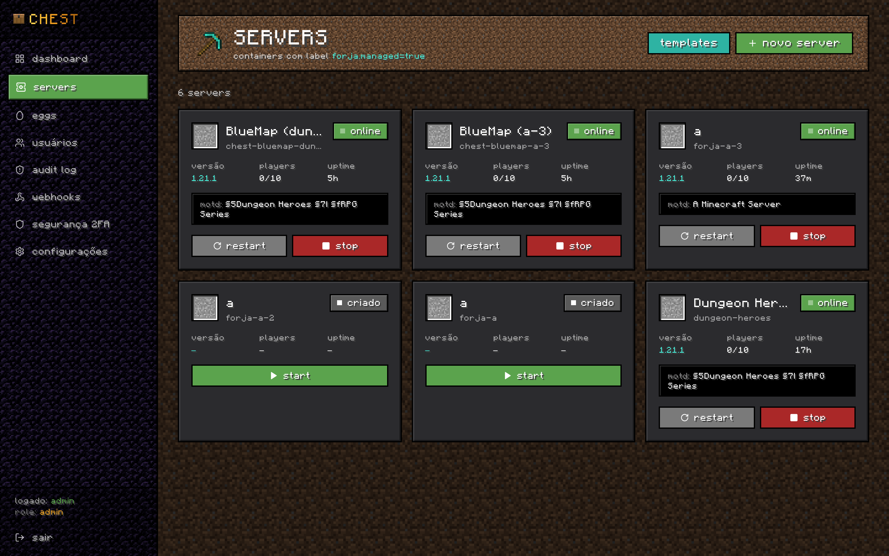</td>
    <td width="33%"></td>
  </tr>
</table>

#### Operacao do servidor

<table>
  <tr>
    <td width="33%"></td>
    <td width="33%">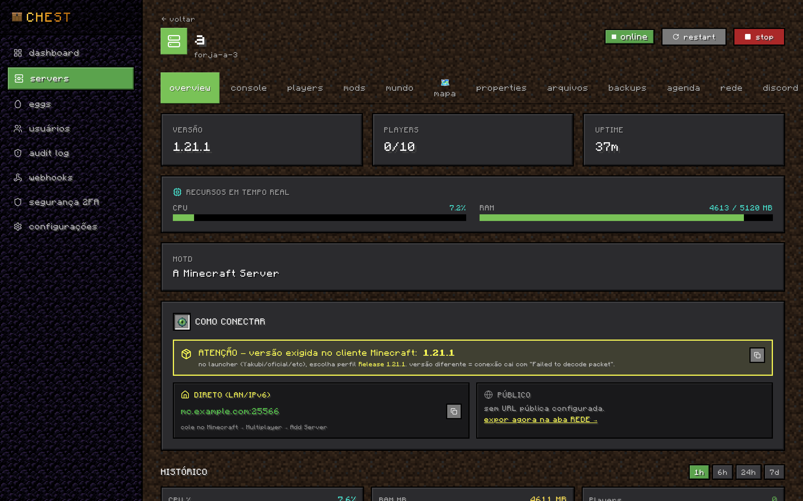</td>
    <td width="33%"></td>
  </tr>
  <tr>
    <td width="33%"></td>
    <td width="33%"></td>
    <td width="33%">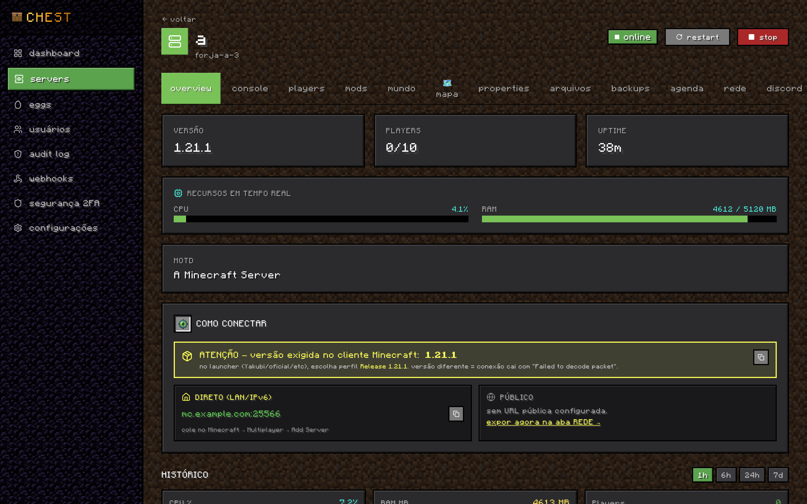</td>
  </tr>
  <tr>
    <td width="33%"></td>
    <td width="33%"></td>
    <td width="33%"></td>
  </tr>
</table>

#### Administracao

<table>
  <tr>
    <td width="33%">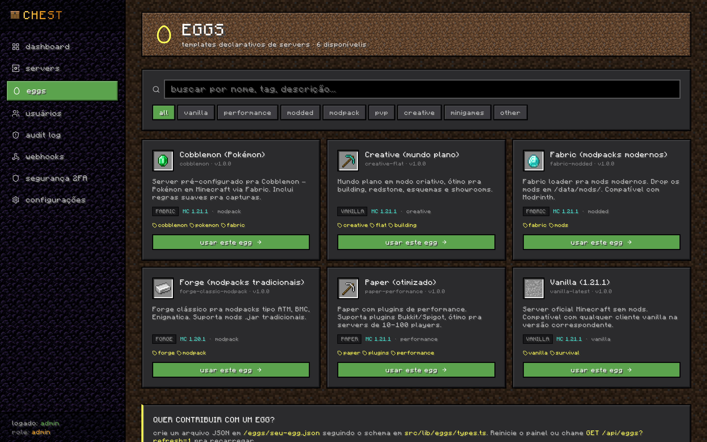</td>
    <td width="33%">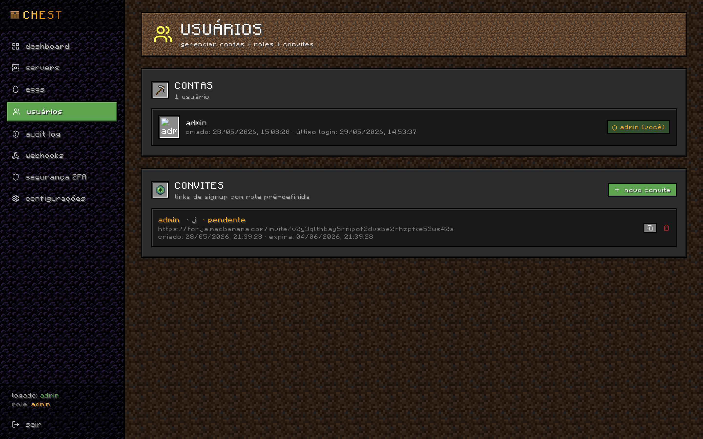</td>
    <td width="33%">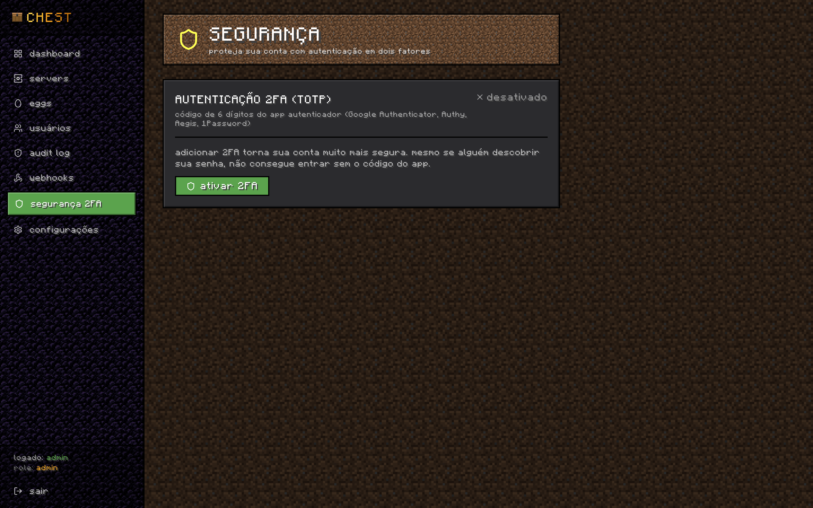</td>
  </tr>
  <tr>
    <td width="33%">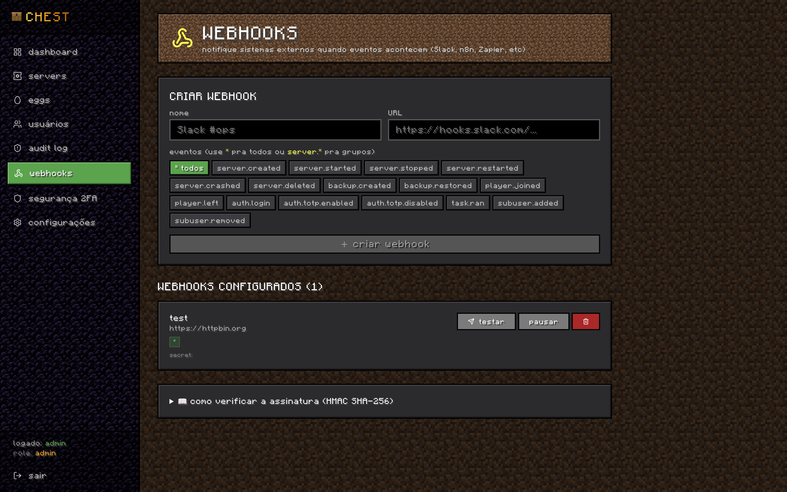</td>
    <td width="33%">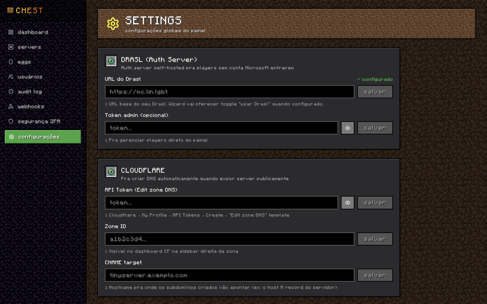</td>
    <td width="33%"></td>
  </tr>
</table>

</details>

---

## Architecture

Chest is a single SvelteKit application that talks to Docker through a proxy, manages Minecraft containers as first-class entities, and exposes optional integrations for storage, observability, and chat.

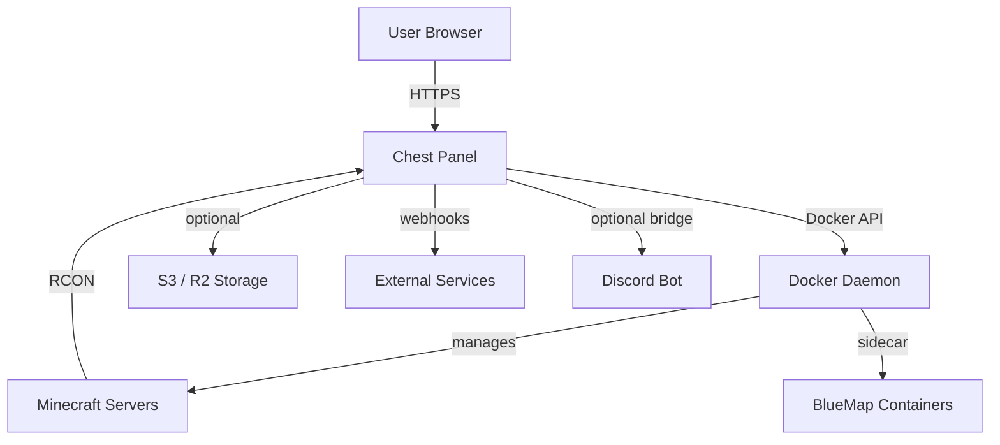

Every Minecraft server is a container managed via labels. Chest never holds state that cannot be reconstructed from the Docker daemon plus its own SQLite database, which makes the whole system reproducible from a `docker compose` file and a single volume backup.

---

## Quick start

```bash
# Recommended: use the setup script (configures git, .env, deps)
git clone https://github.com/ThiagoFrag/chest.git
cd chest
bash scripts/setup.sh
```

### Production: docker-compose.yml

```yaml
services:
  chest:
    image: ghcr.io/your-org/chest:latest
    container_name: chest
    restart: unless-stopped
    environment:
      DATABASE_URL: file:/app/data/db.sqlite
      SESSION_SECRET: ${SESSION_SECRET}
      RCON_KEY: ${RCON_KEY}
      DOCKER_HOST: tcp://chest-socket-proxy:2375
      ORIGIN: https://panel.example.com
      PROTOCOL_HEADER: x-forwarded-proto
    volumes:
      - chest-data:/app/data
    networks:
      - proxy
      - chest-internal
    depends_on:
      - socket-proxy

  socket-proxy:
    image: tecnativa/docker-socket-proxy:0.3
    container_name: chest-socket-proxy
    restart: unless-stopped
    environment:
      CONTAINERS: 1
      POST: 1
      EXEC: 1
      LOGS: 1
      INFO: 1
      NETWORKS: 1
      IMAGES: 1
      VOLUMES: 1
    volumes:
      - /var/run/docker.sock:/var/run/docker.sock:ro
    networks:
      - chest-internal

volumes:
  chest-data:

networks:
  proxy:
    external: true
  chest-internal:
    driver: bridge
    internal: true
```

### Steps

```bash
# 1. Generate secrets
openssl rand -base64 32   # SESSION_SECRET
openssl rand -base64 32   # RCON_KEY

# 2. Create the external proxy network (one-time, reused by your reverse proxy)
docker network create proxy

# 3. Bring the stack up
docker compose up -d

# 4. Grab the initial admin credentials (printed once)
docker logs chest

# 5. Open the panel
open https://panel.example.com
```

Point your reverse proxy at the `chest` container on port `3000` and you are done.

---

## Configuration

### Environment variables

| Variable          | Default                         | Description                                                     |
| ----------------- | ------------------------------- | --------------------------------------------------------------- |
| `DATABASE_URL`    | `file:/app/data/db.sqlite`      | SQLite file location inside the container.                      |
| `SESSION_SECRET`  | required                        | 32+ byte base64 secret used to sign session tokens.             |
| `RCON_KEY`        | auto-generated                  | 32+ byte key used to encrypt per-server RCON passwords at rest. |
| `DOCKER_HOST`     | `tcp://chest-socket-proxy:2375` | Docker API endpoint. Always prefer the socket-proxy.            |
| `ORIGIN`          | `https://panel.example.com`     | Public origin for cookie scoping and CSRF.                      |
| `PROTOCOL_HEADER` | `x-forwarded-proto`             | Reverse-proxy protocol header.                                  |
| `ADMIN_USERNAME`  | `admin`                         | Username for the auto-seeded first admin.                       |
| `TZ`              | container default               | Timezone used by the scheduler.                                 |

### Settings (configured in the UI)

| Key                      | Description                                                         |
| ------------------------ | ------------------------------------------------------------------- |
| `chest.storage.driver`   | `local`, `s3`, or `r2`. Selects the backup storage backend.         |
| `chest.storage.bucket`   | Bucket name for S3 or R2 backups.                                   |
| `chest.storage.endpoint` | Custom endpoint URL (R2 or self-hosted S3).                         |
| `drasl.url`              | Base URL of the Drasl auth server, e.g. `https://auth.example.com`. |
| `drasl.admin_token`      | Admin token for Drasl integration.                                  |
| `discord.bot_token`      | Token for the Discord bridge bot.                                   |
| `discord.guild_id`       | Discord guild used by the bridge.                                   |
| `webhooks.*`             | Per-endpoint configuration, including secret used for HMAC signing. |

Sensitive settings are encrypted with `RCON_KEY` before being written to SQLite.

---

## Tech stack

- **SvelteKit 2** as the fullstack framework
- **Svelte 5** with runes (`$state`, `$derived`, `$effect`, `$props`)
- **Bun 1.x** as the runtime
- **SQLite** with **Drizzle ORM** for persistence and migrations
- **Tailwind CSS 4** for styling
- **dockerode** for the Docker API
- **rcon-client** with a pooled connection layer
- **@node-rs/argon2** and **@oslojs** for password hashing and crypto
- **discord.js 14** for the Discord bridge
- **@aws-sdk/client-s3** for S3 and Cloudflare R2 backups
- **BlueMap** as a sidecar container per world
- **docker-socket-proxy** for hardened Docker access
- **Vitest** for the test suite (107 tests across 16 files)

---

## Testing

```bash
bun run test         # run the full suite once
bun run test:watch   # watch mode while developing
```

The suite covers permission checks, RCON crypto, port allocation, scheduler cron parsing, file-browser safety, webhook signing and dispatch, backup storage drivers, and more.

---

## Contributing

Contributions are welcome. Please read [CONTRIBUTING.md](CONTRIBUTING.md) before opening a PR, and follow the [Code of Conduct](CODE_OF_CONDUCT.md).

### Dev setup

```bash
git clone https://github.com/ThiagoFrag/chest.git
cd chest
bash scripts/setup.sh    # interactively configures git identity + .env + deps
bun run dev
```

The dev server runs on `http://localhost:3000`. See [CONTRIBUTING.md](CONTRIBUTING.md) for details on what the setup script does.

---

## License

Chest is released under the [GNU Affero General Public License v3.0](LICENSE). If you run a modified version of Chest as a network service, you must make the modified source available to its users.
